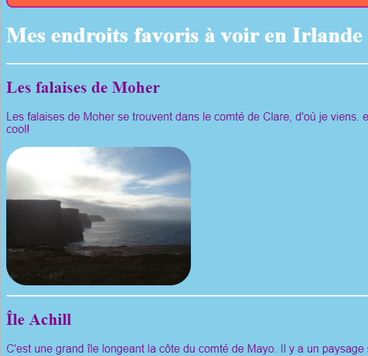
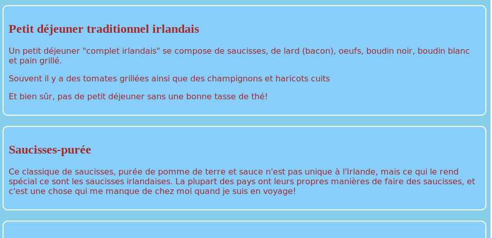
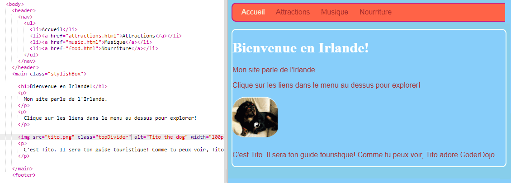

## Concevoir des thèmes

Écrire des règles CSS pour des éléments tels que `section` et `p` est super, mais que faire si tu veux que certains d'entre eux soient différents des autres ? Sur cette carte, tu apprendras à appliquer différents ensembles de règles de style à des éléments du même type et à créer un thème différent pour chaque page de ton site Web!

+ Va à ton fichier de feuille de style et ajoute ce qui suit - n'oublie pas d'inclure le point devant!

```css
  .topDivider {
    border-top-style: solid;
    border-top-width: 2px;
    border-top-color: #F5FFFA;
    padding-bottom: 10px;
  }
```

+ Maintenant, va sur `attractions.html` (ou le fichier HTML sur lequel tu travailles si tu utilises ton propre projet), et ajoute l' **attribut** suivant à chaque balise `section`:

```html
  <section class="topDivider">
```

Tu devrais voir une ligne apparaître au-dessus de chaque section de la page. Félicitations - tu viens d'utiliser ta première **classe CSS**!



+ Examine l’allure actuelle de ta page Web et compare-la aux autres pages comportant des éléments `section`. Tu verras que seuls ceux où tu as ajouté l'attribut `class="topDivider"` auront la ligne en haut.

--- collapse ---
---
title: Comment ça marche?
---

Rappelle-toi que lorsque tu utilises un **sélecteur** CSS comme `section` ou `p` ou `nav ul` , les règles de style s'appliquent à **tous** les éléments de ce type sur ton site Web.

Avec les **classes** CSS, tu es en mesure de changer le style de seulement **certains** des éléments.

Mettre un point devant ton sélecteur en fait un **sélecteur de classe**. Une classe peut avoir n'importe quel nom, il n'est donc pas nécessaire qu'il s'agisse d'un élément HTML. Par exemple:

```css
  .myAwesomeClass {
    /* mon style cool vient ici */
  }
```

Pour choisir les éléments auxquels s'appliquent les règles de style, tu ajoutes la `classe` **attribut** à ces éléments dans le code HTML: indique le nom de la classe comme valeur pour l'attribut, **sans** le point, comme ceci:

```html
  class="myAwesomeClass"
```

--- /collapse ---

+ Prêt à essayer une autre classe? Ajoute ce qui suit au fichier `styles.css`:

```css
  .stylishBox {
    background-color: #87CEFA;
    color: #A52A2A;
    border-style: solid;
    border-width: 2px;
    border-color: #F5FFFA;
    border-radius: 10px;
  }
```

+ Ensuite, sur une page différente de ton site Web, ajoute la classe à certains éléments. Je vais l'ajouter aux éléments `section` sur la page Nourriture de mon site Web, comme ceci: `<section class="stylishBox">`.

Ça a l'air génial, mais maintenant mes sections sont toutes écrasées.



Tu peux appliquer autant de classes CSS à un élément comme tu veux. Il suffit d'écrire les noms de toutes les classes que tu souhaites utiliser dans l'attribut `class` (rappelle-toi, sans le point!), en les séparant par des espaces.

+ Faisons une autre classe CSS pour donner aux sections un peu de marge et de remplissage. Dans le fichier `styles.css`, crée la classe CSS suivante:

```css
  .someSpacing {
    padding: 10px;
    margin-top: 20px;
  }
```

+ Dans ton code `html`, ajoute la nouvelle classe à chacun des éléments sur lesquels tu travailles, comme ceci:

```html
  <section class="stylishBox someSpacing">
```


Les classes CSS te permettent donc de **choisir** les éléments à styler et te permettent de **réutiliser** le même ensemble de règles de style sur les éléments de ton choix.

+ Va dans `index.html` et ajoute la classe `StyloBox` à l'élément `main` ou un autre élément de la page. Tu peux l'enlever à nouveau par la suite!

```html
    <main class="stylishBox">   
```

Voici à quoi ressemble ma page d'accueil avec la classe CSS. J'ai également ajouté la classe `topDivider` à la balise `img` avec l'image de Tito.



--- challenge ---

## Défi: créer de nouvelles classes

+ Utilise les **classes** CSS pour définir différentes tailles d'image pour ton site Web, par exemple `.smallPictures` et `.mediumPictures`. Puis retire l'attribut `width` de chacun de tes éléments `img` et ajoute la classe appropriée à la place.

--- hints ---


--- hint ---

Tu peux créer une classe CSS ne définissant que la largeur d'un élément, comme ceci:

```css
  .smallPictures {
    width: 100px;
  }
```

--- /hint ---

--- hint ---

Voici une balise `img` avec un attribut `width`:

```html
         
```

Lorsque tu supprimes la largeur `width` attribuer et contrôler la taille avec la classe CSS à la place, cela ressemble à ceci:

```html
         
```

En utilisant une classe CSS, tu peux facilement changer la largeur de toutes les images à la fois en modifiant une seule ligne de code dans ta feuille de style!

--- /hint ---

--- /hints ---

--- /challenge ---