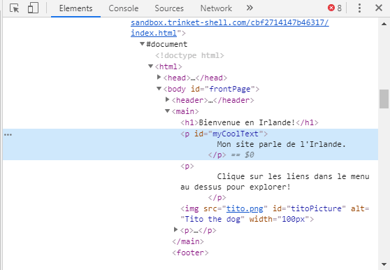

## Voir le code sur d'autres sites!

**Note:** Pour terminer cette étape, tu dois utiliser un de ces navigateurs web : Chrome, Firefox, ou Internet Explorer/Edge. Si tu n'as pas accès à l'un d'entre eux, tu peux simplement passer à la carte suivante.

Sur cette carte, tu apprendras à jeter un coup d'œil sur le code d'un site Web à l'aide de **l'outil inspection** et tu découvriras également comment apporter des modifications que toi seul peux voir!

+ Avant de commencer, assure-toi que ton projet soit enregistré. Ensuite, actualise ton site Web en cliquant sur l'icône d'actualisation de ton navigateur.

+ Sur ta page Web (la page actuelle, pas le code), met en surbrillance le texte avec la bordure que tu as ajouté à la carte précédente, puis clique dessus avec le bouton droit de la souris et sélectionne l'option **Inspecter** dans le menu qui apparaît. (L'option peut s'appeler 'Inspecter élément' ou similaire, selon le navigateur que tu utilises. Si tu rencontres des difficultés pour trouver une option de menu, demande simplement de l’aide à ton Dojo.)


Une toute nouvelle boîte apparaîtra dans ton navigateur Web avec beaucoup d'onglets et de code: les **outils de développement**, ou les ** outils de dev** pour faire court. Ici tu peux voir le code de la chose sur laquelle tu as cliqué, ainsi que le code de la page entière!

### Inspection du code HTML

+ Recherche l'onglet qui affiche le code HTML de la page (il peut s'appeler "Éléments" ou "Inspecteur"). Le code devrait ressembler beaucoup à la façon dont tu l'as tapé dans ton fichier HTML! Tu peux cliquer sur les petits triangles situés à droite pour étendre le code masqué.



+ Double-clique sur le texte entre les balises. Tu devrais pouvoir l'éditer maintenant! Tape quelque chose et appuie sur <kbd>Entrée</kbd> .


+ Vois-tu la mise à jour du texte sur ton site Web? Note : toi seul peux voir ces changements.


+ Maintenant **recharge** la page et regarde ce qui se passe. Tes changements devraient disparaître!

+ Dans le coin supérieur gauche de la zone des outils de développement, clique sur l'icône qui ressemble à un petit rectangle avec une flèche. Maintenant, tu peux déplacer ton curseur sur la page Web et l'inspecteur HTML te montrera le code qui le décrit.

 

### Inspection du code CSS

+ Regardons à présent le code CSS. Recherche les onglets **styles** dans les outils de développement (il peut s’appeler 'Éditeur de style' ou similaire). Tu devrais voir un tas de règles CSS, y compris celles que tu as créées pour ce paragraphe, `#myCoolText`.


+ Dans les règles `#myCoolText`, clique sur la valeur à côté de la propriété `color`. Essaie de taper une valeur différente. Regarde le texte de ta page Web changer de couleur directement! 


Note : tu peux aussi cliquer sur le carré de couleur pour changer la couleur en utilisant un outil de sélection de couleurs.

+ Clique dans l'espace après la couleur. Une nouvelle ligne commence, où tu peux taper plus de CSS. Tape ce qui suit et appuie sur <kbd>Entrée</kbd>:

```css
  background-color: #660066;
```

Tu devrais voir l'arrière-plan changer sur ce morceau de texte.

 

## \--- collapse \---

## title: Comment ça marche?

Lorsque tu modifies du code de site Web à l'aide des outils de développement, tu es en train de changer **temporairement** ce qui apparaît **dans ton navigateur**. Tu ne modifies pas réellement les fichiers qui constituent le site Web.

Lorsque tu actualises la page, tu recharges le site Web à partir de ses fichiers (sur Internet ou sur ton ordinateur). C'est pourquoi tes changements disparaissent.

Maintenant que tu sais cela, tu peux t'amuser à jouer avec le code sur d'autres sites!

\--- /collapse \---

+ Essaie d’utiliser ces outils pour consulter le code sur un autre site Web. Tu peux même apporter des modifications si tu le souhaites! N'oublie pas que toi seul peux voir les modifications que tu apportes et tout sera réinitialisé lorsque tu actualises la page.